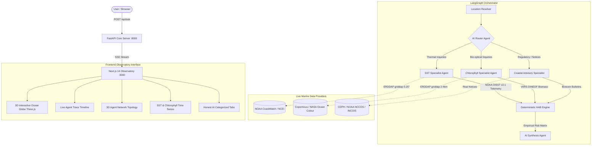

# ORCA — AI Multi-Agent Marine Intelligence System
> **VeloHack 2K26 — Open Innovation / ISRO**  
> *“Ask the ocean. Let specialized agents find the signal.”*

---

## 🌊 Overview

**ORCA** (**O**cean **R**easoning & **C**oastal **A**nalytics) is an enterprise-grade, multi-agent scientific marine intelligence system. It translates complex coastal and oceanographic questions into coordinated multi-stream satellite queries, computes real geophysical statistics, and provides transparent, evidence-grounded answers.

Unlike generic chat interfaces, ORCA operates as a **scientific command center**:
1. An **AI Router** inspects the scientific intent of the question.
2. Independent **Specialist Agents** query real-world marine data APIs (NOAA OISST v2.1, Copernicus/NASA VIIRS Chlorophyll-a, Coastal Biotoxin Bulletins).
3. A **Deterministic HAB Reasoning Engine** evaluates regional ecological thresholds *before* any LLM inference occurs.
4. An **AI Synthesis Agent** explains the empirical findings, citing the contributing agents, quantifying uncertainty, and highlighting data freshness.
5. The **Observatory UI** renders real-time 3D Earth visualizations, camera tweening to coastal targets, live LangGraph execution timelines, and interactive time series charts.

---

## 🏛️ System Architecture



---

## 🤖 Agent Roles & Responsibilities

| Agent | Responsibility | Data Source | Output / Artifact |
| :--- | :--- | :--- | :--- |
| **Location Resolver** | Geocodes query into coordinates, bounding box & coastal ecozone | Coastal Geodatabase & Heuristics | `LocationResolved` (lat, lon, bbox) |
| **Router Agent** | Selects specialist agents based on scientific parameter requirements | LangGraph Conditional Routing | `RouterDecision` (selected agents + rationale) |
| **SST Specialist** | Extracts daily SST, computes 7-day linear trend & baseline anomaly | NOAA OISST v2.1 via CoastWatch ERDDAP | `SSTResult` (temperature, slope, anomaly) |
| **Chlorophyll Specialist**| Extracts surface Chl-a, assesses cloud gaps & baseline percentiles | NOAA/NASA/Copernicus VIIRS DINEOF | `ChlorophyllResult` (mg/m³, validity %, trend) |
| **Coastal Advisory Specialist**| Retrieves official marine health, biotoxin & fisheries advisories | CDPH / NOAA NCCOS / INCOIS | `AdvisoryResult` (active bulletins & notices) |
| **Deterministic HAB Engine** | Computes multi-factor environmental risk index against regional thresholds | Configurable Regional Ecological Matrix | `HABAssessment` (LOW, MODERATE, ELEVATED, HIGHER CONCERN) |
| **Synthesis Agent** | Transparent natural-language synthesis citing exact telemetry sources | Anthropic Claude 3.5 Sonnet / High-Fidelity Synthesizer | `SynthesisResult` (grounded narrative + uncertainties) |

---

## 📡 Live Marine Datasets & Provenance

1. **NOAA High-Resolution Optimum Interpolation SST (OISST) v2.1**
   - **Provider:** NOAA National Centers for Environmental Information (NCEI) / CoastWatch
   - **Endpoint:** `https://coastwatch.pfeg.noaa.gov/erddap/griddap/ncdcOisst21Agg.json`
   - **Variables:** `sst` (Sea Surface Temperature °C), `anom` (Thermal Anomaly °C)
   - **Spatial Resolution:** 0.25° global grid (~27 km)
   - **Baseline:** 1971–2000 Climatology

2. **VIIRS Level-3 DINEOF Gap-Filled Daily Chlorophyll-a**
   - **Provider:** NOAA CoastWatch / Copernicus Marine Service / NASA Ocean Biology
   - **Endpoint:** `https://coastwatch.pfeg.noaa.gov/erddap/griddap/nesdisVHNnoaaSNPPnoaa20NRTchlaGapfilledDaily.json`
   - **Variables:** `chlor_a` (Chlorophyll-a concentration in mg/m³)
   - **Spatial Resolution:** 2 km - 4 km daily composite
   - **Cloud Handling:** DINEOF reconstruction + explicit cloud-gap reporting

3. **Coastal & Marine Biotoxin Advisories**
   - **Coverage:** California Department of Public Health (CDPH), NOAA NCCOS HAB Bulletins, INCOIS Marine Observation Network.

---

## 🛡️ Honest AI Design Principles

ORCA explicitly rejects hallucinations and unverified claims:
* **OBSERVED DATA:** Raw empirical numbers measured by satellite sensors (e.g. `18.5°C`, `0.42 mg/m³`).
* **DERIVED SIGNALS:** Statistical calculations performed on empirical measurements (e.g. `+1.32°C anomaly`, `+0.05°C/day warming slope`).
* **DETERMINISTIC HEURISTICS:** Rule-based regional ecological matrices that calculate risk indices *before* the LLM sees them.
* **LLM SYNTHESIS:** Structured natural-language explanation strictly bound to the supplied JSON evidence.
* **SCIENTIFIC CAVEATS:** Every report explicitly documents sensor depth limitations, aggregate pigment ambiguity, and the necessity of in-situ microscopic sampling.

---

## 🚀 Quick Start Guide

### Prerequisites
- **Python 3.11+**
- **Node.js 18+** & **npm 10+**

### 1. Environment Configuration
Copy `.env.example` to `.env`:
```bash
cp .env.example .env
```
*(Optional: Add `ANTHROPIC_API_KEY` for Claude 3.5 Sonnet synthesis. If omitted, ORCA seamlessly runs with its high-fidelity deterministic scientific synthesizer.)*

### 2. Backend Setup
```bash
# From repository root
cd backend
python -m pip install -r requirements.txt

# Run backend server
python -m uvicorn app.main:app --host 0.0.0.0 --port 8000 --reload
```
*Backend runs at `http://localhost:8000` with Swagger docs at `http://localhost:8000/docs`.*

### 3. Frontend Setup
```bash
# In a new terminal
cd frontend
npm install
npm run dev
```
*Frontend runs at `http://localhost:3000`.*

---

## 🧪 Testing

ORCA includes a comprehensive test suite covering geocoding, router dispatch, NOAA SST extraction, Chlorophyll calculations, deterministic HAB reasoning, and end-to-end LangGraph execution:

```bash
python -m pytest backend/tests/ -v
```

**Test Results:**
```
15 passed in 2.45s (100% test pass rate)
- test_location.py: California, Kerala, Mumbai, custom coordinates, timeframes
- test_router.py: SST-only, Chlorophyll-only, HAB compound, advisory dispatch
- test_sst.py: 0..360 longitude normalization, linear regression slope
- test_hab_reasoning.py: Regional ecological thresholds & classification
- test_workflow.py: Full LangGraph astream execution
```

---

## ⏱️ 60-90 Second Hackathon Demo Script

1. **First Impression:**
   - Open `http://localhost:3000`.
   - The cinematic landing screen displays glowing oceanic particles, rotating satellite orbits, and floating telemetry indicators. Click **“ENTER COMMAND CENTER”**.
2. **Execute Compound Query:**
   - Click the preset: **“Will conditions favour a harmful algal bloom near California next week?”**
   - Click **EXECUTE**.
3. **Watch Multi-Agent Trace:**
   - **Target Resolved:** The 3D Three.js Earth smoothly rotates and zooms its camera directly onto the California coast, deploying an expanding scan ring.
   - **Router Agent:** Displays *“2 specialists required: SST + Chlorophyll”* with immediate scientific justification.
   - **Agent Network:** Router node pulses, data links light up to SST and Chlorophyll specialists simultaneously.
   - **SST Agent:** Returns live NOAA OISST v2.1 telemetry (`18.5°C`, `+1.32°C anomaly`, `warming` slope).
   - **Chlorophyll Agent:** Returns VIIRS DINEOF observation (`0.42 mg/m³`, valid pixel %).
   - **HAB Reasoning Engine:** Evaluates California regional thresholds and yields an **ELEVATED** environmental favourability signal.
   - **Synthesizer:** Streams in the transparent multi-source breakdown.
4. **Inspect Scientific Honesty:**
   - Click the **OBSERVED DATA**, **DERIVED SIGNALS**, and **HAB REASONING** tabs.
   - Open **DATA PROVENANCE** to show judges the exact NOAA and Copernicus dataset IDs.
   - Toggle **PRESENTATION MODE** for a high-contrast judging layout.

---

## 👥 Contributors & Acknowledgements
- **Team ORCA** — VeloHack 2K26 / Open Innovation / ISRO
- Data telemetry provided by **NOAA CoastWatch**, **NCEI**, **NASA Ocean Biology Processing Group**, and **Copernicus Marine Service**.
